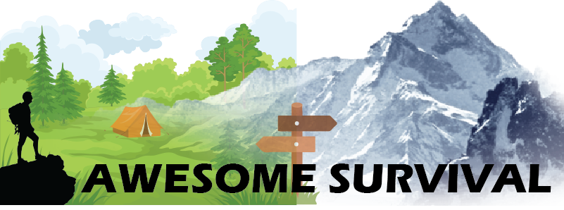

<div align="center">
<h1>awesome-survival</h1>
a list of awesome survival/survivors books/guides


</div>
<div align="center">


<h2>NOTE : Magnet Links are hidden in README.md</h2>


</div>


# Sources

## Surface Web

[meta.wikimedia.org](https://meta.wikimedia.org/wiki/Data_dump_torrents) - unofficial listing of Wikimedia data dump torrents

[survivorlibrary.com](http://www.survivorlibrary.com/) - How to survive when the Technology Doesn't
([Download](https://www.ourpreps.com/downloads/survivor-library-part-1-march-2020-torrent/) - [Part 1](magnet:?xt=urn:btih:0445133AA1174686280C05EF2E037B4B034791FF&dn=survivorlibrary.com_part1_march_2020_torrent_from_ourpreps.com&tr=udp%3a%2f%2ftracker.torrent.eu.org%3a451), [Part 2](magnet:?xt=urn:btih:86C58680E1CB44C693CCF9F0671D51C1FC8990A6&dn=survivorlibrary.com_part2_march_2020_torrent_from_ourpreps.com&tr=udp%3a%2f%2ftracker.torrent.eu.org%3a451), [Part 3](magnet:?xt=urn:btih:CB42766AA98A73EA1BF4BAFBA71069E871FFC727&dn=survivorlibrary.com_part3_march_2020_torrent_from_ourpreps.com&tr=udp%3a%2f%2ftracker.torrent.eu.org%3a451), [Part 4](magnet:?xt=urn:btih:E105EFAD4696EF8CFEE4F540FE2CA77A1FBA4AD4&dn=survivorlibrary.com_part4_march_2020_torrent_from_ourpreps.com&tr=udp%3a%2f%2ftracker.torrent.eu.org%3a451))

<!-- 
https://www.reddit.com/r/DataHoarder/comments/fr0ah4/survivor_library_all_4_parts_over_13700_pdfs/
https://www.ourpreps.com/downloads/survivor-library-part-1-march-2020-torrent/
 -->

[ps-survival.com](http://ps-survival.com/) - improve your chances of survival after the coming Pole Shift ([Download](magnet:?xt=urn:btih:647FD43F7979240EED75C8CC78B004D5D15446B7&dn=ps-survival.com-march-2020&tr=udp%3a%2f%2ftracker.torrent.eu.org%3a451))

<!-- 
https://www.ourpreps.com/downloads/pole-shift-survival-march-2020-torrent/
 -->

[Strategic Intelligence Network](https://hackgence.com/d/124-sin-strategic-intelligence-network) - SIN provides intelligence, resources and tools to be prepared and to respond to crisis situations anywhere you are in the World. [index](https://sin.hackgence-com.workers.dev/0:/index-sin.html) [Original Mirror](https://gooddebate.org/sin/mirror/library/), [Mirror 1](https://sin.hackgence-com.workers.dev/), [Mirror 2 Google Drive](https://drive.google.com/drive/u/0/folders/1oYYl0VtLio39Q4rmbDEVI2iNNejgbbLv)

[CD3WD](https://archive.org/details/2012_cdw3d_dvd_set) - CD3WD is a collection of documents meant to be a 'start over', homesteading, survivalist, or basic knowledge collection of documents, assembled to allow readers to rebuild civilization. [Magnet](magnet:?xt=urn:btih:716B201644F2B3AB64DCE59D8B0399457CEA3E19&dn=2012_cdw3d_dvd_set&tr=http%3a%2f%2fbt1.archive.org%3a6969%2fannounce&tr=http%3a%2f%2fbt2.archive.org%3a6969%2fannounce&ws=https%3a%2f%2farchive.org%2fdownload%2f&ws=http%3a%2f%2fia600308.us.archive.org%2f16%2fitems%2f&ws=http%3a%2f%2fia800308.us.archive.org%2f16%2fitems%2f)

<!-- 
https://archive.org/details/2012_cdw3d_dvd_set
 -->

[index-of.es](http://index-of.es/) - Software Technology Tools, Tutorials, Guides etc

[protesttips.carrd.co](https://protesttips.carrd.co/) - Protest Tips and Tactics from Hong Kong to the World.

[4M .txt Books]() - .txt versions of 4 million books from the library genesis collection (the original is 35TB, this is 70x smaller). a .csv library catalog of books is included. [Magnet (537GB)](magnet:?xt=urn:btih:e839e74594114eaa795595cc84198800fb3b166c&dn=text&tr=udp://tracker.opentrackr.org:1337/announce&tr=udp://p4p.arenabg.com:1337/announce&tr=udp://9.rarbg.to:2710/announce&tr=udp://exodus.desync.com:6969/announce)
<!-- 
https://rutracker.org/forum/viewtopic.php?t=5888503
https://www.reddit.com/r/DataHoarder/comments/fyb6gt/4_million_txt_books_in_537gb/
 -->

[Solar & Survival PDFs]() - Download - [magnet](magnet:?xt=urn:btih:559ac8d34dea55bf49a56bc0130c28cc1ca230cc&dn=Solar%20and%20survival%20books)

<!-- 
https://www.reddit.com/r/PrepperFileShare/comments/hrhmyj/solar_and_survival_pdf_torrent_with_15_books/
 -->

[Firearm Manuals]() - Download - [Magnet](magnet:?xt=urn:btih:57921B16D33D3B5E8E8E246CEFAC80B84BEA188C&dn=Firearm%20Manuals)


[iFixit.com]() - iFixit repair guides in PDF format [Magnet](magnet:?xt=urn:btih:ed9889445d52d7882e844bd926e1b547a2c00781&dn=pdfs.zip&tr=udp%3A%2F%2Ftracker.coppersurfer.tk%3A6969%2Fannounce&tr=udp%3A%2F%2Ftracker.opentrackr.org%3A1337%2Fannounce&tr=udp%3A%2F%2Ftracker.leechers-paradise.org%3A6969%2Fannounce&tr=udp%3A%2F%2Fp4p.arenabg.com%3A1337%2Fannounce)

<!-- 
https://www.reddit.com/r/PrepperFileShare/comments/g5ocdl/ive_collected_all_the_ifixit_repair_guides_in_pdf/
https://archive.org/details/ifixit-pdfs-2020-04
 -->

[Appropriate Technology Library]() - The most comprehensive appropriate technology and sustainable living resource in the world! The AT Library contains the full text and images from over 1050 of the best books dealing with all areas of do-it-yourself technology. [Magnet 1](magnet:?xt=urn:btih:927CEF33C1E320C669ED7913CC1A63736DA530B9&dn=Appropriate+Technology+Library+-1050+eBooks&tr=udp%3A%2F%2Ftracker.coppersurfer.tk%3A6969%2Fannounce&tr=udp%3A%2F%2F9.rarbg.to%3A2920%2Fannounce&tr=udp%3A%2F%2Ftracker.opentrackr.org%3A1337&tr=udp%3A%2F%2Ftracker.internetwarriors.net%3A1337%2Fannounce&tr=udp%3A%2F%2Ftracker.leechers-paradise.org%3A6969%2Fannounce&tr=udp%3A%2F%2Ftracker.coppersurfer.tk%3A6969%2Fannounce&tr=udp%3A%2F%2Ftracker.pirateparty.gr%3A6969%2Fannounce&tr=udp%3A%2F%2Ftracker.cyberia.is%3A6969%2Fannounce) [Magnet 2](magnet:?xt=urn:btih:927cef33c1e320c669ed7913cc1a63736da530b9&dn=Appropriate+Technology+Library+-1050+eBooks&tr=udp%3A%2F%2Ftracker.leechers-paradise.org%3A6969&tr=udp%3A%2F%2Fzer0day.ch%3A1337&tr=udp%3A%2F%2Fopen.demonii.com%3A1337&tr=udp%3A%2F%2Ftracker.coppersurfer.tk%3A6969&tr=udp%3A%2F%2Fexodus.desync.com%3A6969)

<!-- 
https://www.reddit.com/r/PrepperFileShare/comments/fso1zu/appropriate_technology_library_1050_ebooks/
https://pirateproxy.live/torrent/6887249/Appropriate_Technology_Library_-1050_eBooks
https://villageearth.org/appropriate-technology/appropriate-technology-library
 -->

[Great Science Texxtbooks Library]() - Great Science Textbooks DVD Library including all updates as of January 2013 [Magnet Collection](magnet:?xt=urn:btih:C2830A8A4D5B450309BA4CC8283BFA729818507F&dn=GreatScienceTextbooksDvdLibraryTorrentsfullCollection&tr=http%3a%2f%2fbt1.archive.org%3a6969%2fannounce&tr=http%3a%2f%2fbt2.archive.org%3a6969%2fannounce&ws=https%3a%2f%2farchive.org%2fdownload%2f&ws=http%3a%2f%2fia601607.us.archive.org%2f4%2fitems%2f&ws=http%3a%2f%2fia801607.us.archive.org%2f4%2fitems%2f)

<!-- 
https://archive.org/details/GreatScienceTextbooksDvdLibraryTorrentsfullCollection

 -->

[Library Genesis](http://gen.lib.rus.ec/)

[ZetaTalk11](http://www.zetatalk11.com/docs/) - it leads you through the vast amount of information being relayed by the Zetas

## Deep Web

---------------------------------------

# Applications

## Android

[Survival Manual](https://f-droid.org/packages/org.ligi.survivalmanual/) - Survival Manual (F-DROID)

## Windows/Linux

[Libgen Desktop](https://wiki.mhut.org/software:libgen_desktop) - Libgen Desktop is a Windows application for browsing a local copy of LibGen catalog

---------------------------------------

# Blogs

[wiki.collapsenetwork.org](https://wiki.collapsenetwork.org/) - a practical wiki for navigating collapse

[rtl-sdr.com](https://www.rtl-sdr.com/) - GPS Decoding & Plotting, Weather Satellite Images

[Fluidic Ice](https://fluidicice.com/home)

# Boards

[forum.sdr-radio.com](https://forum.sdr-radio.com/)

[r/preppers](https://www.reddit.com/r/preppers/)

[r/PrepperFileShare](https://www.reddit.com/r/PrepperFileShare/) - A place for preppers to share PDFs, Docs, and any other useful information.

[r/Survival](https://www.reddit.com/r/Survival/)

[r/Survivalist](https://www.reddit.com/r/Survivalist/)

[r/PostCollapse](https://www.reddit.com/r/PostCollapse/)

[r/DataHoarder](https://www.reddit.com/r/DataHoarder/)

[r/datacurator](https://www.reddit.com/r/datacurator/)

[r/Archiveteam](https://www.reddit.com/r/Archiveteam/)

[r/CollapseNetwork](https://www.reddit.com/r/CollapseNetwork/)


# YT Channels

[Primitive Technology](https://www.youtube.com/channel/UCAL3JXZSzSm8AlZyD3nQdBA)

[Northmen](https://www.youtube.com/channel/UCcaVClI50rGZmbYMhoSSDGA)


## Disclaimer
```
Compilation is Still Under Progress
```
